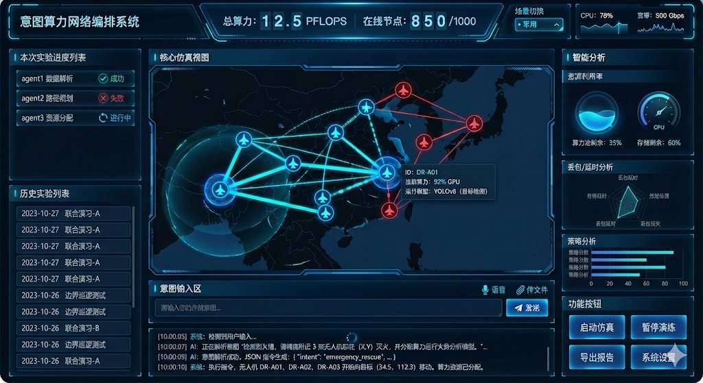

# 意图算力网络平台 —— 前端实施方案

> 科研导向 · 低代码 · “蓝色科技风”  
> Author: _**（填你名字）**_ · Date: _**（填日期）**_

---

## 1. 目标与范围

|维度|目标|
|---|---|
|项目定位|“数字孪生 + 意图驱动网络”科研演示系统|
|必做模块|• 意图交互 & 聊天历史 <br>• 现实场景 / 网络拓扑可视化 <br>• 算力 & 网络资源调度动画 <br>• 右侧智能图表分析|
|演示场景|① 军用无人机协同作战 ② 民用无人机救灾 ③ **留扩展槽**（更多 IoT 场景）|
|成果形式|‣ 可运行的 Web Demo（本地或静态托管）<br>‣ 项目报告 / 论文截图素材|

---

## 2. 技术选型

|层级|技术|说明|
|---|---|---|
|核心框架|**Vue 3 + TypeScript + Vite**|轻量、文档友好|
|UI 库|**Element Plus**（暗黑主题）|省时省力，直接科技感|
|大屏/装饰|**DataV Vue3**|边框、数字翻牌、光圈|
|拓扑 / 关系图|**AntV G6**|拖拽、自动布局、事件丰富|
|地图（可选）|**Leaflet**|2D 深色底图，轻依赖|
|图表|**ECharts**|右侧仪表盘、折线、雷达|
|状态管理|**Pinia**|组合式 API|
|代码质量|ESLint + Prettier + Husky|可选，保证规范|

---

## 3. 系统功能架构

mermaid

```
graph LR
A(用户意图输入) --> B{意图解析<br/>(Mock 或 GPT API)}
B --> C(场景/拓扑层) --> D(图表分析层)
C -->|位置/连线更新| D
C -->|节点状态更新| E(左侧会话/历史)
B -->|执行反馈| E
```

---

## 4. UI / 交互设计草图



配色：

- 主背景：#0D1B2A（深蓝）
- 高亮：#00D8FF / #2196F3
- 字体：DIN / 微软雅黑粗体

---

## 5. 核心模块拆解

|模块|关键点|依赖|UI 组件|
|---|---|---|---|
|Header|系统信息实时闪烁|Pinia 状态|DataV dv-border-box, dv-digital-flop|
|LeftSidebar|历史指令 & 状态|useChatStore|Element Timeline|
|CenterPanel|① 地图底图 ② UAV 节点 ③ 拓扑连线 ④ 选中弹窗|Leaflet + AntV G6 + Pinia|自定义 MapContainer.vue|
|RightSidebar|资源 / 网络 / AI 任务图|ECharts|BaseChart.vue (封装)|
|BottomChat|意图输入 -> mock 解析 -> 触发动画|if-else 模拟 / GPT API|InteractionArea.vue|
|全局装饰|边框光效、呼吸灯|DataV / CSS|TechCard.vue, GlowButton.vue|

---

## 6. 关键数据模型（TypeScript）

TypeScript

```
// types/simulation.d.ts
export interface Position {
  lat: number
  lng: number
}

export type NodeType = 'host' | 'router' | 'switch'

export interface DroneNode {
  id: string
  type: NodeType
  role: string
  position: Position
  specs: {
    cpu?: string
    gpu?: string
    memory?: string
    bandwidth?: string
  }
  status: 'idle' | 'active' | 'error'
}

export interface Task {
  id: string
  name: string
  progress: number // 0-100
  targetNodes: string[]
  createdAt: number
}
```

---

## 7. 工程目录

text

```
src/
├── assets/                  # 静态资源
│   ├── images/              # 图片 (无人机图标, 背景图, 所有的svg素材)
│   ├── styles/ 
│   │    └── global.css      # 全局样式 (重置CSS, 字体, 科技风通用的边框/发光效果 mixin)
│   └── icons/               # 自定义图标或引入的字体图标库
│
├── components/              # 【通用组件库】(与具体业务无关的基础UI)
│   ├── common/
│   │   ├── TechCard.vue     # 封装好的带科技感边框的容器 (复用率极高)
│   │   ├── GlowButton.vue   # 发光按钮
│   │   └── LoadingSpinner.vue # 科技风加载动画
│   └── chart/               # 图表封装 (ECharts/DataV的通用配置)
│       └── BaseChart.vue    # 通用的图表组件，封装折线图、雷达图、饼图
│
├── views/                   # 【页面级视图】
│   └── Dashboard/           # 你的核心大屏页面
│       ├── index.vue        # 大屏主入口 (负责圣杯布局的网格搭建)
│       ├── components/      # 【业务组件】(对应你画的几个具体区块)
│       │   ├── LeftPanel/
│       │   │   ├── TaskProgress.vue     # [左上] 本次实验进度 (Agent状态列表)
│       │   │   └── HistoryExperiments.vue # [左下] 历史实验列表
│       │   ├── CenterPanel/
│       │   │   ├── MapContainer.vue     # [中间] 核心仿真视图 (Leaflet/G6 逻辑)
│       │   │   └── NodeTooltip.vue      # 鼠标悬停节点时的弹窗
│       │   ├── RightPanel/
│       │   │   ├── AnalysisBoard.vue    # [右上] 智能分析 (包含3个图表子组件)
│       │   │   └── ActionButtons.vue    # [右下] 功能按钮区
│       │   └── BottomPanel/
│       │       ├── ChatMessageItem.vue  # 单条对话气泡
│       │       └── InteractionArea.vue  # [底部] 包含输入框、语音、文件上传
│
├── store/                   # 【状态管理 (Pinia)】
│   ├── index.ts
│   ├── useSimulationStore.ts# 核心数据：节点坐标、任务状态、无人机属性
│   └── useChatStore.ts      # 聊天数据：历史记录、正在输入的文字、文件状态
│
├── hooks/                   # 【组合式函数 (Composables)】(逻辑复用)
│   ├── useMapMap.ts         # 地图初始化、打点、连线逻辑抽离
│   ├── useWebSocket.ts      # 如果有后端，这里处理实时通信；没有则做Mock模拟
│   └── useSpeechToText.ts   # 处理语音转文字的逻辑
│
├── types/                   # 【TypeScript 类型定义】
│   ├── simulation.d.ts      # 定义 Drone, Task, Topology 接口
│   └── chat.d.ts            # 定义 Message, Intent 接口
│
├── utils/                   # 【工具函数】
│   ├── mockData.ts          # 存放演示用的假数据 (非常重要！)
│   ├── mapHelper.ts         # 坐标转换、距离计算等算法
│   └── request.ts           # Axios 封装
│
├── App.vue                  # 根组件
└── main.ts                  # 入口文件 (引入 Element Plus, Pinia, 样式)
```

---

## 8. 交互流程（示例：民用灭火）

1. 用户输入
    
    text
    
    ```
    调度 3 架无人机前往 (34.5,112.3) 灭火
    ```
    
2. `IntentParser()`（Mock）输出
    
    JSON
    
    ```
    {
      "intent": "fire_rescue",
      "nodes": ["UAV-03", "UAV-07", "UAV-09"],
      "dest": { "lat": 34.5, "lng": 112.3 }
    }
    ```
    
3. `useSimulationStore` 更新节点目标 → CenterPanel 动画移动
4. `calculateResource()` 随机生成 CPU/GPU 曲线 → 右侧图表闪动
5. 完成后 push 一条会话记录到 `useChatStore` → 左侧时间线刷新

---

## 9. 开发里程碑（5–6 周）

|周次|任务|产出|
|---|---|---|
|1|环境初始化；圣杯布局；全局暗色主题|跑通 `Hello Tech`|
|2|接入 **ECharts/DataV**；右侧图表静态化|3 个深色图表|
|3|MapContainer：Leaflet 打点 + 拖拽；弹窗|无人机能点能动|
|4|BottomChat → Mock 解析 → 更新拓扑&图表|整体链路打通|
|5|美化 + 动画 + 响应式优化|“科技风”成品|
|6（缓冲）|写论文截图、部署 Vercel/GitHub Pages|Demo URL + 报告|

---

## 10. 部署与运行

Bash

```
# 安装依赖
pnpm i            # 或 npm i / yarn
# 本地开发
pnpm dev          # Vite 热更新
# 生产构建
pnpm build        # dist/ 目录
# 静态托管
pnpm preview      # 本地预览
```

部署推荐：GitHub Pages / Vercel / 阿里云 OSS 均可。

---

## 11. 风险 & 缓解

|风险|对策|
|---|---|
|拓扑过大导致卡顿|① 限制节点数量 ② Canvas 渲染模式|
|没有 GPT/大模型 API|`if-else` Mock，重点展示流程|
|学术答辩突发 Demo 挂掉|本地录屏兜底；准备离线演示包|

---

## 12. 后续可扩展

- 真·意图解析：接入 OpenAI / 文心一言 API
- WebSocket 实时联动后端仿真引擎
- 3D 升级：Cesium / Three.js 做全空间漫游
- 算力调度算法可视化：甘特图 + Sankey 流向